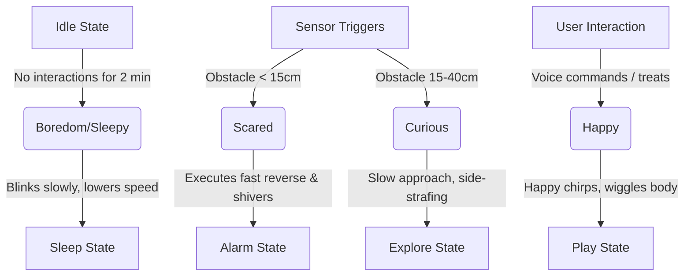

# RoverBuddy — AI Pet Companion & Assistant
> **A lively, expressive desktop companion powered by Raspberry Pi 4B, Mecanum wheels, and the Gemini API.**

---

## 1. Product Overview

**RoverBuddy** transforms a standard 4-wheel robot car into a living, responsive desktop pet. Instead of moving in simple linear paths, it uses **Mecanum wheels** to slide sideways, tilt, and express excitement, curiosity, or caution. 

By running a web app that features an **animated digital face**, RoverBuddy can be mounted with a smartphone, giving it eyes that blink, look around, and react to its environment. When spoken to using its wake-word (*"Hey Rover"*), it queries the Gemini API under a custom pet persona, returning responses that simultaneously dictate its speech, facial expressions, and physical movements.

```
       ┌───────────────────────────┐
       │     Smartphone Screen     │   ◄── Displays Rover's eyes/mouth (face.js)
       ├───────────────────────────┤
       │      Raspberry Pi 4       │   ◄── Processes sensors, streams camera, runs TTS
       ├───────────────────────────┤
       │  2x L298N Motor Drivers   │   ◄── Drive 4x DC motors independently
       └─────────┬───────┬─────────┘
         FL Wheel│       │FR Wheel     ◄── Mecanum wheels allow omnidirectional
         RL Wheel│       │RR Wheel         strafing, wiggling, and drifting
```

---

## 2. Hardware Architecture

### Omnidirectional Mecanum Drive
Unlike standard wheels, Mecanum wheels have rollers angled at 45° around their circumference. By turning wheels in specific directions, the forces combine to slide the robot in any vector:

| Movement | Front-Left (FL) | Front-Right (FR) | Rear-Left (RL) | Rear-Right (RR) |
|---|---|---|---|---|
| **Forward** | ⇧ Forward | ⇧ Forward | ⇧ Forward | ⇧ Forward |
| **Backward** | ⇩ Backward | ⇩ Backward | ⇩ Backward | ⇩ Backward |
| **Strafe Left** | ⇩ Backward | ⇧ Forward | ⇧ Forward | ⇩ Backward |
| **Strafe Right** | ⇧ Forward | ⇩ Backward | ⇩ Backward | ⇧ Forward |
| **Diagonal F-L** | ◯ Stop | ⇧ Forward | ⇧ Forward | ◯ Stop |
| **Diagonal F-R** | ⇧ Forward | ◯ Stop | ◯ Stop | ⇧ Forward |
| **Spin Left** | ⇩ Backward | ⇧ Forward | ⇩ Backward | ⇧ Forward |
| **Spin Right** | ⇧ Forward | ⇩ Backward | ⇧ Forward | ⇩ Backward |

### 2x L298N Wiring Configuration
To control all 4 wheels independently, we use **two L298N drivers**. Each driver handles two motors.

```
                  ┌──────────────────────┐
                  │   Raspberry Pi 4B    │
                  └─┬──────┬──────┬──────┘
       L298N #1     │      │      │     L298N #2
     (Left Wheels)  ▼      ▼      ▼   (Right Wheels)
     ┌──────────────┐            ┌──────────────┐
     │ ENA, IN1-2   │            │ ENB, IN3-4   │   ◄── Front Motors
     │ ENB, IN3-4   │            │ ENA, IN1-2   │   ◄── Rear Motors
     └─┬──────────┬─┘            └─┬──────────┬─┘
       ▼          ▼                ▼          ▼
    Motor      Motor            Motor      Motor
  Front-Left Rear-Left       Front-Right Rear-Right
```

---

## 3. The Emotional Engine

RoverBuddy keeps track of three main internal mood variables (ranging from `0.0` to `1.0`) in a background process:



### Mood Metrics
1.  **Happiness (Joy):** Increased by feeding treats or speaking to it. Decays slowly.
    *   *High (>0.7):* Wiggles frequently, makes high-pitched chirps, eyes are happy crescent shapes.
    *   *Low (<0.3):* Whimpers, moves slower, eyes droop.
2.  **Curiosity (Alertness):** Increased by sensor activity (seeing objects move past).
    *   *High (>0.6):* Explores autonomously, tilts its camera up/down, looks side-to-side.
3.  **Fear (Startle Response):** Triggered by rear triggers or extreme sudden proximity blocks.
    *   *High (>0.8):* Screeches stop, executes a fast backup wiggle, and shivers.

---

## 4. AI-Coordinated Interaction

RoverBuddy uses the **Google Gemini API** to generate responses. By setting the API response format to JSON, RoverBuddy's mind directly drives its body.

### Example Exchange

*   **User says:** *"Hey Rover, are you awake? Can you show me a trick?"*
*   **Gemini API output:**
    ```json
    {
      "speech": "Beep boop! Fully charged and ready! Watch this sideways slide!",
      "emotion": "happy",
      "action": "spin"
    }
    ```
*   **Robot Execution:**
    1.  Plays a happy synth sweep.
    2.  TTS Engine speaks: *"Beep boop! Fully charged and ready! Watch this sideways slide!"*
    3.  Face Canvas changes to blinking green circle eyes.
    4.  Mecanum driver executes a continuous orbital spin for 1.5 seconds.

---

## 5. Web Interface Layout

The interface offers a responsive, glassmorphic dark-mode control center:

```
┌──────────────────────────────────────────────────────────┐
│ 🤖 RoverBuddy UI       [Status: Connected]   [E-STOP]    │
├───────────────────────┬──────────────────────────────────┤
│                       │  📋 CHAT & VOICE                 │
│  📷 LIVE CAMERA FEED  │  ┌────────────────────────────┐  │
│  ┌─────────────────┐  │  │ User: Hey Rover!           │  │
│  │                 │  │  ├────────────────────────────┤  │
│  └─────────────────┘  │  │ Rover: Beep! Hello friend! │  │
│                       │  └────────────────────────────┘  │
│  📡 PROXIMITY RADAR   │  🎙️ [Tap to Speak (Wake Word)]    │
│       (Front)         ├──────────────────────────────────┤
│     \    |    /       │  ⚡ PRECISION STRAFE CONTROLS    │
│   (FL)  (F)  (FR)     │          ( Strafe Pad )          │
│                       │          ▲  Up-Left            │
│  (RL)         (RR)    │      ◀ ─ ┼ ─ ▶  Left/Right     │
│     \         /       │          ▼  Down-Right         │
│      (Rear)           │                                  │
└───────────────────────┴──────────────────────────────────┘
```

---

## 6. Project Roadmap

1.  **Phase 1: Basic Locomotion & Simulation Core**
    *   Install backend dependencies (Flask, SocketIO, pyttsx3).
    *   Implement 4-wheel Mecanum motor logic in `motors.py` with mock simulation fallback.
2.  **Phase 2: Animated Canvas Face & Web GUI**
    *   Design the glassmorphism dashboard.
    *   Create `face.js` supporting standard expressions (Happy, Curious, Sad, Sleeping, Listening) with smooth HTML5 Canvas animations.
3.  **Phase 3: Wakeword & Speech integration**
    *   Implement browser-based Web Speech recognition monitoring for *"Hey Rover"*.
    *   Configure SocketIO triggers to pass questions to the Gemini API.
4.  **Phase 4: Emotional State & Hardware Deployment**
    *   Connect real HC-SR04 ultrasonic sensor routines.
    *   Wire L298N drivers to Raspberry Pi and calibrate the duty cycles for accurate omnidirectional strafing.
