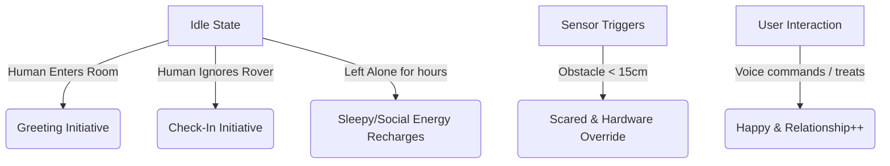

# RoverBuddy (AURUS V2) — AI Pet Companion & Assistant
> **A lively, expressive desktop companion powered by Raspberry Pi 4B, Mecanum wheels, Computer Vision, and the Gemini API.**

---

## 1. Product Overview

**RoverBuddy** transforms a standard 4-wheel robot car into a living, responsive desktop pet. Instead of moving in simple linear paths, it uses **Mecanum wheels** to slide sideways, tilt, and express excitement, curiosity, or caution. 

With the massive **V2 Upgrade**, RoverBuddy now boasts a proactive relationship engine, an SQLite long-term memory system, real-time facial and object recognition, and an Explainable AI (XAI) dashboard to understand its thought process.

```
       ┌───────────────────────────┐
       │     Smartphone Screen     │   ◄── Displays Rover's eyes/mouth & UI Dashboard
       ├───────────────────────────┤
       │      Raspberry Pi 4       │   ◄── Processes sensors, streams camera, runs CV/TTS
       ├───────────────────────────┤
       │  2x L298N Motor Drivers   │   ◄── Drive 4x DC motors independently
       └─────────┬───────┬─────────┘
         FL Wheel│       │FR Wheel     ◄── Mecanum wheels allow omnidirectional
         RL Wheel│       │RR Wheel         strafing, wiggling, and drifting
```

---

## 2. Hardware Architecture

### Omnidirectional Mecanum Drive
Unlike standard wheels, Mecanum wheels have rollers angled at 45° around their circumference. By turning wheels in specific directions, the forces combine to slide the robot in any vector:

| Movement | Front-Left (FL) | Front-Right (FR) | Rear-Left (RL) | Rear-Right (RR) |
|---|---|---|---|---|
| **Forward** | ⇧ Forward | ⇧ Forward | ⇧ Forward | ⇧ Forward |
| **Backward** | ⇩ Backward | ⇩ Backward | ⇩ Backward | ⇩ Backward |
| **Strafe Left** | ⇩ Backward | ⇧ Forward | ⇧ Forward | ⇩ Backward |
| **Strafe Right** | ⇧ Forward | ⇩ Backward | ⇩ Backward | ⇧ Forward |
| **Spin Left** | ⇩ Backward | ⇧ Forward | ⇩ Backward | ⇧ Forward |
| **Spin Right** | ⇧ Forward | ⇩ Backward | ⇧ Forward | ⇩ Backward |

---

## 3. The Emotional & Proactive Engine

RoverBuddy keeps track of internal mood variables (ranging from `0.0` to `1.0`) in a background process, ensuring it acts like a living creature rather than a passive assistant:



### Mood Metrics
1.  **Happiness (Joy):** Increased by feeding treats or speaking to it. Decays slowly.
2.  **Curiosity (Alertness):** Increased by sensor activity (seeing objects move past).
3.  **Social Energy:** Depleted by interaction, recharged when alone. Prevents the bot from being overly annoying.
4.  **Relationship Strength:** Grows over days of positive interactions, logged in the database.

---

## 4. AI-Coordinated Interaction & Vision

RoverBuddy uses the **Google Gemini API** combined with local **MediaPipe** vision to generate responses. 

### Computer Vision
The robot continuously scans its environment:
- **Presence Tracking:** Determines if a human is in the room ("Present" vs "Absent") to trigger greetings or sleep states.
- **Follow Mode:** Computes X/Y bounding boxes to calculate the precise angle needed to pivot the robot, while using Sonar ping distance to approach and maintain a 40cm gap from the human.

### Example Exchange & XAI

*   **User says:** *"Hey Rover, follow me!"*
*   **System Action:**
    1.  The **Intent Router** detects the regex `follow me`.
    2.  The API is bypassed, and the state switches to `mode_follow`.
    3.  The **Follow Loop** takes over the motors.
    4.  The **Explainable AI (XAI)** dashboard flashes:
        *   `Decision: Action: FOLLOW_START`
        *   `Reason: Follow Intent Detected`
        *   `Confidence: 98%`
        *   `Source Data: User: follow me!`

---

## 5. Web Interface Layout

The interface offers a responsive, glassmorphic dark-mode control center:

```
┌──────────────────────────────────────────────────────────┐
│ 🤖 RoverBuddy UI       [Simulation Mode]     [Run Demo]  │
├───────────────────────┬──────────────────────────────────┤
│                       │  📋 ACTIVE EXPRESSION            │
│  📷 LIVE CAMERA FEED  │  ┌────────────────────────────┐  │
│  [ Mock Feed Active ] │  │  (👁️)      (👁️)            │  │
│                       │  └────────────────────────────┘  │
│  🧠 XAI DEBUG PANEL   │                                  │
│  Decision: Greeting   │  📊 EMOTIONAL ENGINE             │
│  Reason: Presence     │  [======= ] Happiness 50%        │
│                       │  [========] Curiosity 60%        │
│                       │                                  │
│  🕹️ VIRTUAL ARENA     │  ⚡ CHAT & MANUAL CONTROLS       │
│  [ Top-Down Map ]     │     [ Strafe Pad ]               │
└───────────────────────┴──────────────────────────────────┘
```

---

## 6. Project Roadmap (V2 Update)

1.  **Phase 1-4 (V1): Locomotion, Web UI, Wake-word, Mood Engine**
    *   *Complete.* Basic remote-controlled pet with Gemini TTS integration.
2.  **Phase 5-6: Adaptive Emotional Engine & Initiatives**
    *   *Complete.* Added Social Energy. Rover greets users when they walk in.
3.  **Phase 7-8: Advanced Vision & Memory**
    *   *Complete.* Added OpenCV Follow Mode, Object Detection, and SQLite Memory with Daily Summaries.
4.  **Phase 9-10: Transparency & Automation**
    *   *Complete.* Added live XAI Debug Feed and a 1-click Demonstration Mode script.
